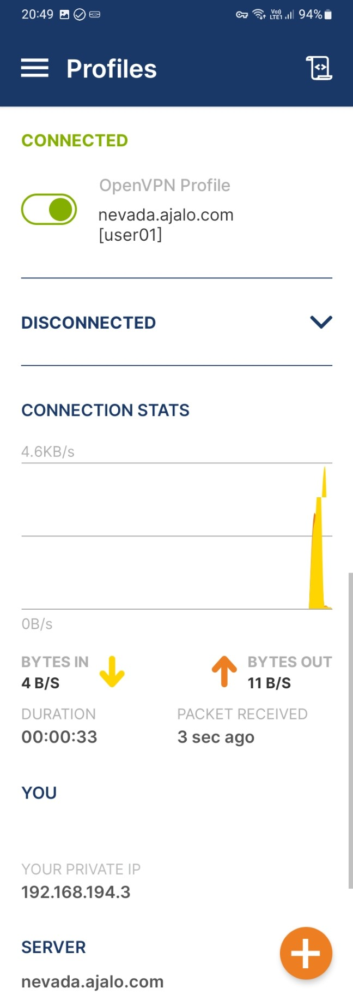
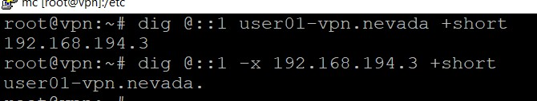

TOC:
<!-- TOC -->

- [Старт в DevOps.](#%D1%81%D1%82%D0%B0%D1%80%D1%82-%D0%B2-devops)
    - [Развертывание серверов](#%D1%80%D0%B0%D0%B7%D0%B2%D0%B5%D1%80%D1%82%D1%8B%D0%B2%D0%B0%D0%BD%D0%B8%D0%B5-%D1%81%D0%B5%D1%80%D0%B2%D0%B5%D1%80%D0%BE%D0%B2)
        - [Подготовка к развертыванию](#%D0%BF%D0%BE%D0%B4%D0%B3%D0%BE%D1%82%D0%BE%D0%B2%D0%BA%D0%B0-%D0%BA-%D1%80%D0%B0%D0%B7%D0%B2%D0%B5%D1%80%D1%82%D1%8B%D0%B2%D0%B0%D0%BD%D0%B8%D1%8E)
        - [Сервер PKI](#%D1%81%D0%B5%D1%80%D0%B2%D0%B5%D1%80-pki)
        - [Сервер VPN](#%D1%81%D0%B5%D1%80%D0%B2%D0%B5%D1%80-vpn)
        - [Сервер мониторинга](#%D1%81%D0%B5%D1%80%D0%B2%D0%B5%D1%80-%D0%BC%D0%BE%D0%BD%D0%B8%D1%82%D0%BE%D1%80%D0%B8%D0%BD%D0%B3%D0%B0)
        - [Завершение развертывания](#%D0%B7%D0%B0%D0%B2%D0%B5%D1%80%D1%88%D0%B5%D0%BD%D0%B8%D0%B5-%D1%80%D0%B0%D0%B7%D0%B2%D0%B5%D1%80%D1%82%D1%8B%D0%B2%D0%B0%D0%BD%D0%B8%D1%8F)
- [Резервное копирование](#%D1%80%D0%B5%D0%B7%D0%B5%D1%80%D0%B2%D0%BD%D0%BE%D0%B5-%D0%BA%D0%BE%D0%BF%D0%B8%D1%80%D0%BE%D0%B2%D0%B0%D0%BD%D0%B8%D0%B5)
- [Схема потоков данных](#%D1%81%D1%85%D0%B5%D0%BC%D0%B0-%D0%BF%D0%BE%D1%82%D0%BE%D0%BA%D0%BE%D0%B2-%D0%B4%D0%B0%D0%BD%D0%BD%D1%8B%D1%85)
- [Скриншоты](#%D1%81%D0%BA%D1%80%D0%B8%D0%BD%D1%88%D0%BE%D1%82%D1%8B)
    - [Корневой сертификат](#%D0%BA%D0%BE%D1%80%D0%BD%D0%B5%D0%B2%D0%BE%D0%B9-%D1%81%D0%B5%D1%80%D1%82%D0%B8%D1%84%D0%B8%D0%BA%D0%B0%D1%82)
    - [Win10, ipsec, myip](#win10-ipsec-myip)
    - [Win10, openvpn, myip](#win10-openvpn-myip)
    - [Android, ipsec](#android-ipsec)
    - [Android, openvpn](#android-openvpn)
    - [Android, myip](#android-myip)
    - [Vpn server DNS](#vpn-server-dns)
    - [Promrtheus alerts, web](#promrtheus-alerts-web)
    - [Prometheus alerts, rules](#prometheus-alerts-rules)
- [Планы по развитию](#%D0%BF%D0%BB%D0%B0%D0%BD%D1%8B-%D0%BF%D0%BE-%D1%80%D0%B0%D0%B7%D0%B2%D0%B8%D1%82%D0%B8%D1%8E)
    - [Веб сайт компании](#%D0%B2%D0%B5%D0%B1-%D1%81%D0%B0%D0%B9%D1%82-%D0%BA%D0%BE%D0%BC%D0%BF%D0%B0%D0%BD%D0%B8%D0%B8)
    - [Корпоративная почта](#%D0%BA%D0%BE%D1%80%D0%BF%D0%BE%D1%80%D0%B0%D1%82%D0%B8%D0%B2%D0%BD%D0%B0%D1%8F-%D0%BF%D0%BE%D1%87%D1%82%D0%B0)
    - [Управление пользователями](#%D1%83%D0%BF%D1%80%D0%B0%D0%B2%D0%BB%D0%B5%D0%BD%D0%B8%D0%B5-%D0%BF%D0%BE%D0%BB%D1%8C%D0%B7%D0%BE%D0%B2%D0%B0%D1%82%D0%B5%D0%BB%D1%8F%D0%BC%D0%B8)
    - [Генерация ключей онлайн](#%D0%B3%D0%B5%D0%BD%D0%B5%D1%80%D0%B0%D1%86%D0%B8%D1%8F-%D0%BA%D0%BB%D1%8E%D1%87%D0%B5%D0%B9-%D0%BE%D0%BD%D0%BB%D0%B0%D0%B9%D0%BD)
    - [Файловое хранилище](#%D1%84%D0%B0%D0%B9%D0%BB%D0%BE%D0%B2%D0%BE%D0%B5-%D1%85%D1%80%D0%B0%D0%BD%D0%B8%D0%BB%D0%B8%D1%89%D0%B5)
    - [Внутренние информационные ресурсы](#%D0%B2%D0%BD%D1%83%D1%82%D1%80%D0%B5%D0%BD%D0%BD%D0%B8%D0%B5-%D0%B8%D0%BD%D1%84%D0%BE%D1%80%D0%BC%D0%B0%D1%86%D0%B8%D0%BE%D0%BD%D0%BD%D1%8B%D0%B5-%D1%80%D0%B5%D1%81%D1%83%D1%80%D1%81%D1%8B)

<!-- /TOC -->

# Старт в DevOps.

    Для решения задачи используется бесплатный домен **ajalo.com**, полученный на [freedns.afraid.org](https://freedns.afraid.org), поэтому далее в документации упоминание "проект ajalo" относится к учебной задаче Skillbox по курсу "Старт в DevOps".

    Информационная инфраструктура компании из учебной задачи представлена тремя
серверами, развернутыми на платформе Google Cloud.

Сервера компании:

**montana.ajalo.com – PKI сервер.**

    Здесь расположен шифрованный контейнер с ключами для vpn сервиса и инструменты работы с контейнером, опубликован CRL и метрики Prometheus. Устанавливается пакетом setup-montana.

**nevada.ajalo.com – VPN сервер.**

    Здесь расположены серверы openvpn и strongswan для vpn подключения клиентов по протоколам openvpn и ipsec ikev2, dns сервер для клиентов, опубликованы метрики Prometheus. Устанавливается пакетом setup-nevada.

**ohio.ajalo.com – сервер мониторинга и резервного копирования.**

    Здесь расположен Prometheus с alertmanager, почтовый смартхост для пересылки писем на сторонний MTA, хранилище последних резервных
копий с других серверов. Устанавливается пакетом setup-ohio.

> **Текущая версия проекта не поддерживает развертывание более одного сервера на одной виртуальной машине.**

## Развертывание серверов

    Подготовка и развертывание серверов выполняется с linux машины.

Перед началом следует подготовить аккаунт Google Cloud, создать в нем проект, приготовить к работе утилиту gcloud согласно документации Google. В инструкции далее предполагается, что управление осуществляется одним администратором - владельцем аккаунта.

    По умолчанию создаются виртуальные машины с минимальной аппаратной конфигурацией и ОС Debian, что вполне подходит для решения задачи.

### Подготовка к развертыванию

    Создаем политику снапшотов и правила firewall:

```bash
gcloud compute resource-policies create snapshot-schedule "daily-snaps" --max-retention-days 2 --start-time "02:00" --daily-schedule
gcloud compute firewall-rules create tcp-80  --target-tags=http --allow=tcp:80 --description="Allow incoming http" --direction=INGRESS
gcloud compute firewall-rules create tcp-443 --target-tags=https --allow=tcp:443 --description="Allow incoming https" --direction=INGRESS
gcloud compute firewall-rules create tcp-993 --target-tags=vpn --allow=tcp:993 --description="Allow incoming vpn-1" --direction=INGRESS
gcloud compute firewall-rules create ikev2 --target-tags=vpn   --allow=udp:500,udp:4500,esp --description="Allow incoming ikev2" --direction=INGRESS
```

    Создаем виртуальные машины в разных дата центрах:

```bash
gcloud compute instances create pki --tags=http,https --zone=europe-west1-с
gcloud compute instances create vpn --tags=vpn,https --zone=europe-west2-с
gcloud compute instances create office --tags=http,https --zone=europe-west3-c
```

    Назначаем политику снапшотов дискам виртуальных машин:

```bash
gcloud compute disks add-resource-policies pki --resource-policies "daily-snaps"
gcloud compute disks add-resource-policies vpn --resource-policies "daily-snaps"
gcloud compute disks add-resource-policies office --resource-policies "daily-snaps"
```

    Создаем ключевые пары для резервного копирования:

```bash
mkdir ~/deploy-keys
cd ~/deploy-keys
for k in "office" "vpn" "pki" ; do
    echo "generate keys for $k in ./$k"
    ssh-keygen -t ed25519 -f "./$k-key" -C "remotebackup-$k" -N ""
done
```

    Полученные ключевые пары понадобятся для развертывания серверов:

```bash
~/deploy-keys/pki-key
~/deploy-keys/pki-key.pub
~/deploy-keys/vpn-key
~/deploy-keys/vpn-key.pub
~/deploy-keys/office-key
~/deploy-keys/office-key.pub
```

> **После завершения развертывания ключевые пары следует удалить:**
> 
> ```bash
> rm -Rf ~/deploy-keys
> ```

### Сервер PKI

    В процессе развертывания будут сгенерированы несколько файлов, содержащих критически важную информацию. Эти файлы следует удалить после завершения установки.

    Подключаемся к серверу:

```bash
gcloud compute ssh pki
```

    Добавляем собственный репозиторий:

```bash
wget -nc https://tegho.github.io/small_office_vpn/apt-repo/pool/main/my-repo_0.1-1_all.deb
dpkg -i ./my-repo_0.1-1_all.deb
apt update
```

    Устанавливаем пакет настройки сервера:

```bash
apt install -y setup-montana
```

    Положим в `/root/pki-key` закрытый ключ для резервного копирования `pki-key`, полученный на этапе подготовки.

    Установим ключ для для SSH резервного копирования и после удалим копию:

```bash
/usr/share/backup-to-ssh/import-ssh-priv.sh /root/pki-key
rm -f /root/pki-key
```

    Добавим конфигурацию для обновления DNS записи:

```bash
echo 'DDNS_URL='\''http://sync.afraid.org/MONTANA-DDNS-KEY/'\' >> /etc/ddns-afraid-org.d/montana.ajalo.com.conf
systemctl restart ddns-afraid-org
```

    Пакет setup-montana для настройки сервера устанавливает зашифрованный контейнер с инфраструктурой PKI в каталог `/root/pki-montana`. Подробная информация о шифрованных контейнерах PKI в описании пакета `crypt-pki`.

    При первичной установке автоматически создается шифрованный контейнер, генерируются случайные пароли для доступа к контейнеру и для закрытого ключа корневого сертификата.

> **После завершения развертывания пароли следует сохранить в надежном месте и удалить файлы с сервера PKI:**
> 
> ```bash
> /root/pki-montana/pki_password
> /root/pki-montana/ca_key_password
> ```

    Также при первичной установке автоматически создаются сертификаты для всех серверов в проекте.

> **Эти сертификаты понадобятся для развертывания других серверов. Необходимо сохранить их в надежном месте и удалить после завершения развертывания:**
> 
> ```bash
> /root/pki-montana/server-vpn.zip
> /root/pki-montana/prometheus-client.zip
> ```

### Сервер VPN

    Подключаемся к серверу:

```bash
gcloud compute ssh vpn
```

    Добавляем собственный репозиторий и docker репозиторий:

```bash
wget -nc https://tegho.github.io/small_office_vpn/apt-repo/pool/main/my-repo_0.1-1_all.deb
dpkg -i ./my-repo_0.1-1_all.deb
apt update
apt install -y docker-repo
```

    Устанавливаем пакет настройки сервера:

```bash
apt install -y setup-nevada
```

    Положим в `/root/vpn-key` закрытый ключ для резервного копирования `vpn-key`, полученный на этапе подготовки.

    Установим ключ для для SSH резервного копирования и после удалим копию:

```bash
/usr/share/backup-to-ssh/import-ssh-priv.sh /root/vpn-key
rm -f /root/vpn-key
```

    Добавим конфигурацию для обновления DNS записи:

```bash
echo 'DDNS_URL='\''http://sync.afraid.org/NEVADA-DDNS-KEY/'\' >> /etc/ddns-afraid-org.d/nevada.ajalo.com.conf
systemctl restart ddns-afraid-org
```

    Положим в `/root/server-vpn.zip` архив с сертификатом, полученный при развертывании сервера PKI.

    Установим сертификат и удалим копию:

```bash
/usr/share/setup-nevada/import-zip.sh /root/server-vpn.zip
rm -f /root/server-vpn.zip
```

    Перезапустим сервисы с новым сертификатом:

```bash
systemctl restart strongswan openvpn-server@vpn1 nginx
```

### Сервер мониторинга

    Подключаемся к серверу:

```bash
gcloud compute ssh office
```

    Добавляем собственный репозиторий:

```bash
wget -nc https://tegho.github.io/small_office_vpn/apt-repo/pool/main/my-repo_0.1-1_all.deb
dpkg -i ./my-repo_0.1-1_all.deb
apt update
```

    Устанавливаем пакет настройки сервера и последнюю версию certbot:

```bash
apt install -y setup-ohio certbot-snap-assist
```

    Создадим новый сертификат для веб-сервера:

```bash
certbot certonly --non-interactive --agree-tos --standalone --email admin@ajalo.com --domain ohio.ajalo.com
```

    Добавим конфигурацию для обновления DNS записи:

```bash
echo 'DDNS_URL='\''http://sync.afraid.org/OHIO-DDNS-KEY/'\' >> /etc/ddns-afraid-org.d/ohio.ajalo.com.conf
systemctl restart ddns-afraid-org
```

    Положим в `/root` ключи для резервного копирования, полученные на этапе подготовки:

```bash
/root/office-key
/root/office-key.pub
/root/pki-key.pub
/root/vpn-key.pub
```

    Установим открытые ключи и после удалим копии:

```bash
/usr/share/backup-to-ssh/import-ssh-priv.sh /root/office-key
/usr/share/setup-ohio/import-ssh-pub.sh /root/office-key.pub remotebackup-office
/usr/share/setup-ohio/import-ssh-pub.sh /root/pki-key.pub remotebackup-pki
/usr/share/setup-ohio/import-ssh-pub.sh /root/vpn-key.pub remotebackup-vpn
rm -f /root/office-key /root/office-key.pub /root/pki-key.pub /root/vpn-key.pub
```

    Положим в `/root/prometheus-client.zip` архив с сертификатом, полученный при развертывании сервера PKI.

    Установим сертификат и удалим копию:

```bash
/usr/share/setup-ohio/import-zip.sh /root/prometheus-client.zip
rm -f /root/prometheus-client.zip
```

    Для настройки почтового смартхоста необходимо подготовить файл конфигурации `/root/mail.secrets` следующего образца:

```bash
fromname="InfoBot"
from="my-informer-bot@yandex.ru"
smarthost="smtp.yandex.ru"
smarthost_port="587"
passwd="SecretYandexPassword"
adminmail="admin-real-email@aol.com"
```

    Выполним конфигурацию почты и удалим файл настроек:

```bash
/usr/share/setup-ohio/config-mail.sh /root/mail.secrets
rm -f /root/mail.secrets
```

    Перезапустим сервисы с новым сертификатом:

```bash
systemctl restart nginx
```

### Завершение развертывания

    На этом этом этапе следует проверить надежно ли сохранены пароли PKI контейнера и корневого сертификата, а затем удалить эти пароли с сервера PKI. Также следует удалить все фалы, упомянутые в инструкции по развертыванию.

    Дальнейшая работа с системой описана инструкциями администратора [README.ajalo.admin.md](README.ajalo.admin.md) и инструкцией пользователя [README.ajalo.user.md](README.ajalo.user.md).

# Резервное копирование

    Резервное копирование серверов проекта осуществляется двумя средствами.

    Первое - снапшоты облачной платформы. В инструкции по развертыванию задано создание ежедневно снапшота дисков серверов с сохранением двух наиболее актуальных снапшотов.

    Второе - резервные копии наиболее важных настроек и данных пакетом `backup-to-ssh`, а именно каталогов `/etc` каждого сервера и зашифрованного контейнера с PKI за последнюю неделю.

    В обоих способах архивные данные не покидают облачную платформу, а значит не могут считаться абсолютно надежными. Однако, хранение резервных копий за последние несколько дней оставляет достаточно времени для отложенного копирования архивных данных в другие хранилища доступные организации. Это могут быть хранилища google или amazon где нужно соблюдать строгие условия тарификации, локальный сервер или ленточный накопитель компании с ограниченной скоростью канала и др.

# Схема потоков данных


    Файл `/doc/dataflow.drawio` содержит схематичное представление потоков данных в созданной системе. Открыть файл можно в онлайн сервисе https://draw.io

# Скриншоты

## 1. Корневой сертификат


## 2. Win10, ipsec, myip


## 3. Win10, openvpn, myip


## 4. Android, ipsec


## 5. Android, openvpn



## 6. Android, myip


## 7. Vpn server DNS



## 8. Promrtheus alerts, web


## 9. Prometheus alerts, rules


# Планы по развитию

    В зависимости от количества и текучки сотрудников, объемов обрабатываемой информации, бюджета, а также многих других факторов, приоритеты в планах развития могут варьироваться. Основные задачи на развитие можно выделить следующие:

## Веб сайт компании

    Веб сайт является визитной карточной компании и в большинстве организаций - важным средством продвижения продукции и услуг. Над наполнением, сопровождением и продвижением сайта может работать большое количество специалистов, поэтому задержка в развертывании может повлечь неоправданные простои и снижение коммерческих показателей компании. Создание сайта является приоритетной задачей и может быть выполнено на стороннем хостинге или на арендованном виртуальном сервере.

## Корпоративная почта

    Почтовый сервис на собственном домене выполняет функции обмена деловой информацией с клиентами или между коллегами. Отправка почты с частных адресов может негативно сказаться на имидже компании, поэтому развертывание почтового сервиса имеет приоритет. Для решения задачи можно обратиться к почтовым хостингам, позволяющим привязать собственный домен,  рассмотреть развертывание почтового сервера как подписку на SaaS или же создание собственного почтового сервера на арендованной виртуальной машине. Каждый из этих вариантов различается затратами на развертывание, поддержание и гибкостью функционала, поэтому должен быть рассмотрен исходя из конкретных условий. Например почтовый хостинг с привязкой своего домена имеет огромные преимущества, такие как удобный веб-интерфейс, доступ с мобильных устройств, надежную фильтрацию спама итд. При относительно небольшом штате это выгодное решение.

## Управление пользователями

    По мере роста штата в компании необходима система управления пользователями и ее интеграция с другими сервисами. Создание, удаление и назначение прав пользователей это неотъемлемая часть работы IT отдела с первого дня работы компании. В связи с этим, задача может претендовать на высший приоритет, но при небольшом штате и ограниченных ресурсах может быть немного отложена.

    Система учета пользователей используется всеми сервисами компании и должна иметь гибкие возможности интеграции, а также удобный интерфейс управления. При небольшом размере компании и для быстрого запуска есть смысл воспользоваться готовым решением например Active Directory на облачных платформах AWS/Azure или развернуть собственный AD на базе Samba/Microsoft в арендованной виртуальной машине. Облачные платформы предлагают гораздо более богатый сервис для пользователя и администратора и снижают трудозатраты по поддержке.

## Генерация ключей онлайн

    При динамично меняющемся штате генерация пользовательских ключей станет огромной проблемой для администратора и техподдержки. Причина тому в разном уровне подготовки пользователей, разнообразии пользовательских ОС, многоступенчатой процедуре генерации/запроса/ответа/установки. Предложенные в этом проекте решения имеют ряд ограничений и возможно потребуют доработки в будущем. При действительно большом потоке выпускаемых сертификатов есть смысл рассмотреть возможность разработки веб интерфейса и пользовательского приложения-агента под разные ОС для автоматизированной генерации ключей на пользовательском устройстве и выпуска клиентских сертификатов без участия администратора.

## Файловое хранилище

    Файлообменник является важной частью организации и позволяет организовать рабочие документы сотрудников, обеспечить взаимообмен файлами, автоматическую обработку отдельных категорий и централизованное резервное копирование.

    Как и в случае с другими сервисами, наименее затратным в обслуживании и наиболее богатым по функционалу будет подписка на облачный сервис, а наиболее гибким и настраиваемым решением будет создание собственного фалового хранилища на арендованной виртуальной машине. Простым кроссплатформанным решением для небольшого офиса было бы Samba или WebDAV хранилище.

## Внутренние информационные ресурсы

    Со временем может возникнуть необходимость централизованного размещения корпоративной информации, инструкций, добавления хелпдеска, информационных чат-ботов итд. Это не самые приоритетные задачи, однако некоторые из них могут заметно облегчить работу сотрудников.
